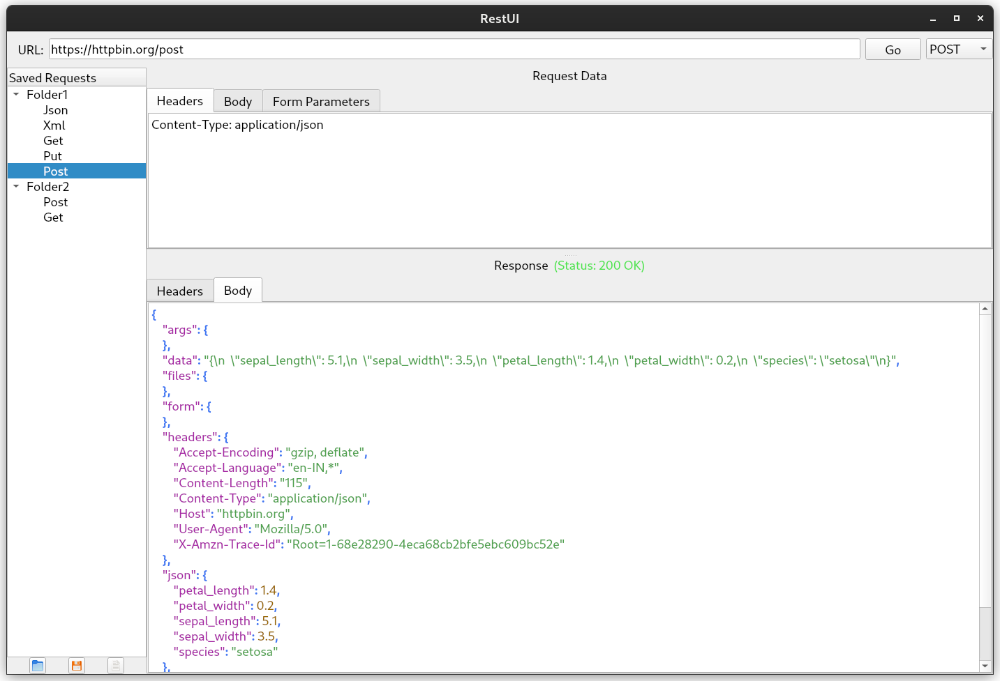

# RestUI

A lightweight Qt-based REST client for testing and managing HTTP requests with syntax-highlighted responses and saved request management. The codebase
was generated using AI, showcasing innovative use of technology in software development.



## Overview

RestUI is a desktop application built with Qt that allows users to send HTTP requests (GET, POST, PUT, DELETE) and view responses with syntax highlighting for formats like JSON, XML, HTML, CSS, and JavaScript. It features a user-friendly interface to save, organize, and manage requests in a tree-like structure, with support for folders and drag-and-drop reordering.

## Features
- Send HTTP requests with customizable methods, headers, and body data.
- Syntax highlighting for JSON, XML, HTML, CSS, and JavaScript responses using the KSyntaxHighlighting library.
- Save and load requests with a persistent storage system.
- Organize requests into folders with drag-and-drop support to:
  - Reorder folders and requests.
  - Move requests between folders and root level.
- Unique request name handling with conflict resolution options (Replace, Keep Both, Cancel).
- Tooltips on hover over saved requests showing method and URL.
- Responsive UI with tabbed views for headers, body, and form parameters.

## Requirements
- **Qt**: Version 5.15 or later (Qt 6.x recommended).
- **KSyntaxHighlighting**: KDE Frameworks library (`libkf5syntaxhighlighting-dev` on Debian-based systems).
- **Build Tools**: `qmake` and a C++17-compatible compiler.

## Installation

### Build Instructions
1. **Clone the Repository**:
   ```bash
   git clone https://github.com/vrrv64/restui.git
   cd restui
   ```

2. **Set Up Qt**:
   Ensure Qt is installed and configured in your environment. Set the `QTDIR` environment variable to your Qt installation path if needed.

3. **Build the Project**:
   ```bash
   qmake restui.pro
   make
   ```

4. **Run the Application**:
   ```bash
   ./restui
   ```

## Usage

1. Launch RestUI: Run the application to access the main interface.
2. Enter a URL (e.g., https://jsonplaceholder.typicode.com/posts/1) and select a method (GET, POST, etc.).
3. Customize headers or body data in the respective tabs.
4. Click "Go" to send the request and view the response with syntax highlighting.
5. Save requests by clicking the save icon and naming them; organize them into folders.
6. Use drag-and-drop to reorder items or move requests between folders and the root level.
7. Hover over saved requests to see tooltips with method and URL.

## License

RestUI is licensed under the MIT License. See [LICENSE](LICENSE) for details.

## Acknowledgments

- Built with Qt Framework.
- Syntax highlighting powered by KSyntaxHighlighting from KDE Frameworks.
- Inspired by REST client tools like Java rest-client (https://github.com/wiztools/rest-client) and 
    CocoaRestClient (https://github.com/mmattozzi/cocoa-rest-client)

### Icons
- **Generic gradient lineal-color icon** by [Freepik](https://www.freepik.com) - [Free vector icon](https://www.freepik.com/icon/letter-r_16935714)


